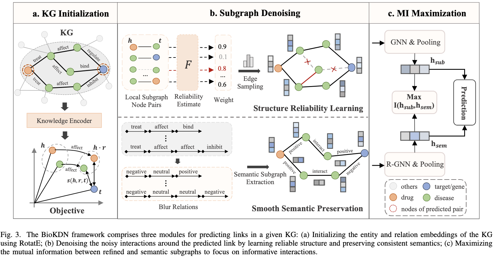

# Learning to Denoise Biomedical Knowledge Graph for Robust Molecular Interaction Prediction

This is the code necessary to run experiments on the BioKDN algorithm described in the paper [Biomedical Knowledge Graph-enhanced Denoising Network](https://ieeexplore.ieee.org/document/10706014).

## Abstract
Molecular interaction prediction plays a crucial role in forecasting unknown interactions between molecules, such as drug-target interaction (DTI) and drug-drug interaction (DDI), which are essential in the field of drug discovery and therapeutics. Although previous prediction methods have yielded promising results by leveraging the rich semantics and topological structure of biomedical knowledge graphs (KGs), they have primarily focused on enhancing predictive performance without addressing the presence of inevitable noise and inconsistent semantics. This limitation has hindered the advancement of KG-based prediction methods. To address this limitation, we propose BioKDN (Biomedical Knowledge Graph Denoising Network) for robust molecular interaction prediction. BioKDN refines the reliable structure of local subgraphs by denoising noisy links in a learnable manner, providing a general module for extracting task-relevant interactions. To enhance the reliability of the refined structure, BioKDN maintains consistent and robust semantics by smoothing relations around the target interaction. By maximizing the mutual information between reliable structure and smoothed relations, BioKDN emphasizes informative semantics to enable precise predictions. Experimental results on real-world datasets show that BioKDN surpasses state-of-the-art models in DTI and DDI prediction tasks, confirming the effectiveness and robustness of BioKDN in denoising unreliable interactions within contaminated KGs.


## Requiremetns

All the required packages can be installed by running `pip install -r requirements.txt`.
```
dgl==1.1.2
lmdb==1.4.1
networkx==3.0
scikit-learn==0.22.1
torch==2.0.0
tqdm==4.61.2
```

### Data Prepare
To reproduce the results of BioKDN. You should download the knowledge graph [DRKG](https://github.com/gnn4dr/DRKG) for you personal seetings, or download the KG and KGE embeddings from [Google Driver](https://drive.google.com/file/d/1kkA50mXBTJUCoHCX49LCGKyfei7Tifid/view?usp=sharing). 


## Example for DTI prediction
To test BioKDN on the DTI task, run the following command. 
- `python main.py --task_type dti --dataset drugbank`


## Acknowledgment
If you make use of this code or the SDN algorithm in your work, please cite the following paper:

```
  @ARTICLE{10706014,
  author={Ma, Tengfei and Chen, Yujie and Tao, Wen and Zheng, Dashun and Lin, Xuan and Pang, Patrick Cheong-Iao and Liu, Yiping and Wang, Yijun and Wang, Longyue and Song, Bosheng and Zeng, Xiangxiang and Yu, Philip S.},
  journal={IEEE Transactions on Knowledge and Data Engineering}, 
  title={Learning to Denoise Biomedical Knowledge Graph for Robust Molecular Interaction Prediction}, 
  year={2024},
  volume={36},
  number={12},
  pages={8682-8694},
  doi={10.1109/TKDE.2024.3471508}
  }
```


The code is implemented based on GraIL (https://github.com/kkteru/grail). We thank you very much for their code sharing.